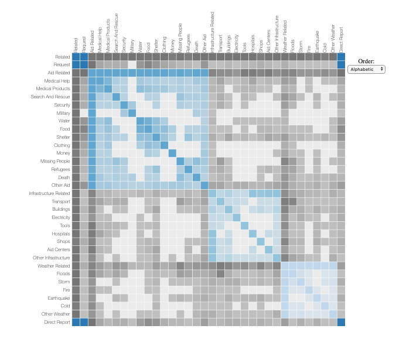
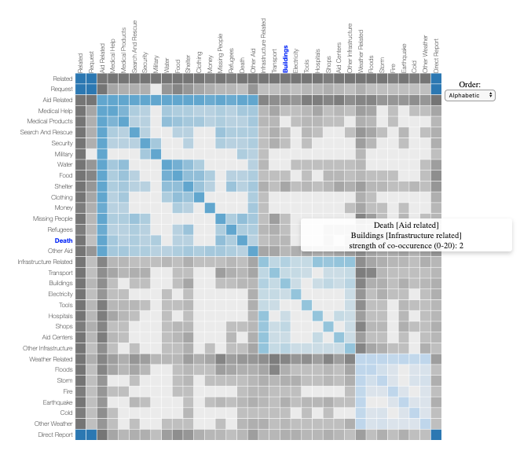

# Disaster Response Project

### 1 - Context:
In the face of a global pandemic and a majority of resources (including time) being rightly alotted to fighting it, I started thinking about working on a project that would be aimed at maximizing efficiency of strained responses to non-CovID related emergencies. There are thousands of messages that teams managing response efforts have to comb through in order to determine and assign the category of response required (ex. food, shelter..). 

Figure Eight provides a dataset of labeled multilingual disaster messages from social, direct, and news sources. These labels correspond to the categories of disaster responses.

#### The goal for this project is therefore to build a model that can accurately classify these messages. 

> Multilabel text classification task with imbalanced classes 

### 2 - Visual inspection of (cleaned) data
Used d3.js to build an interactive visualization of the co-occurrence matrix of category labels, grouped by:
* aid-related messages
* infrastructure-related messages
* weather-related messages
* message type

To view (with local data file), run an HTTP server from folder that contains the `index.html` file with python 3: `$ python -m http.serv`

Following is a screenshot:

and with tooltip:

Acknowledgments: Mike Bostock's d3.js [implementation](https://bost.ocks.org/mike/miserables/) of *Les Miserables* character co-occurrence, and Déborah Mesquita's [Medium article](https://towardsdatascience.com/building-a-co-occurrence-matrix-with-d3-to-analyze-overlapping-topics-in-dissertations-fb2ae9470dee)

### 3 - Model:
I've trained a few different models of increasing complexity so far (Naive Bayes & deep models such as Bidirectional GRU or a fastText-like model)

* Best performance is by finetuning pretrained **BERT-base-uncased model** + Classifier (Dense output layer with sigmoid activation to predict probabilities) using the `ktrain` library
	* Training accuracy: 0.9423, validation accuracy: 0.9457
	* more flexible model is in the works, built using the `transformers` library from **HuggingFace** with tensorflow/keras

* Threshold moving for imbalanced classes: I've chosen to take the threshold that corresponds to the max geometric mean between the weighted ROC-AUC scores and the F1 scores for the validation set.

### 4 - Deployment:
Since the goal of this project is to use the capabilities of the model for real time inference of messages, I built a web app (using Flask) for users to enter queries and quickly extract the query's predicted classification labels.

To run the app locally on your machine: `$ python run.py`. Current configuration: host='0.0.0.0', port=4444.

